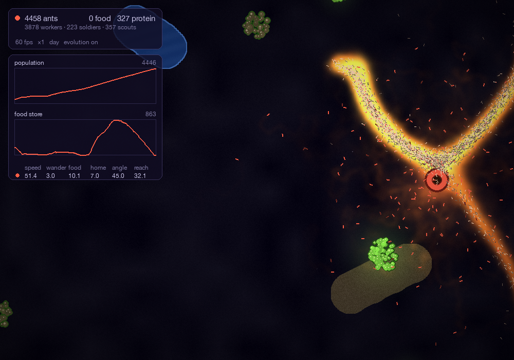
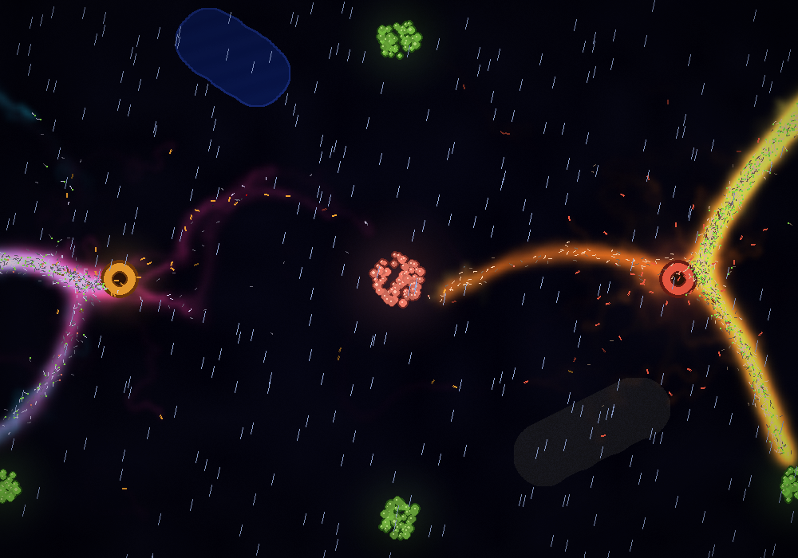
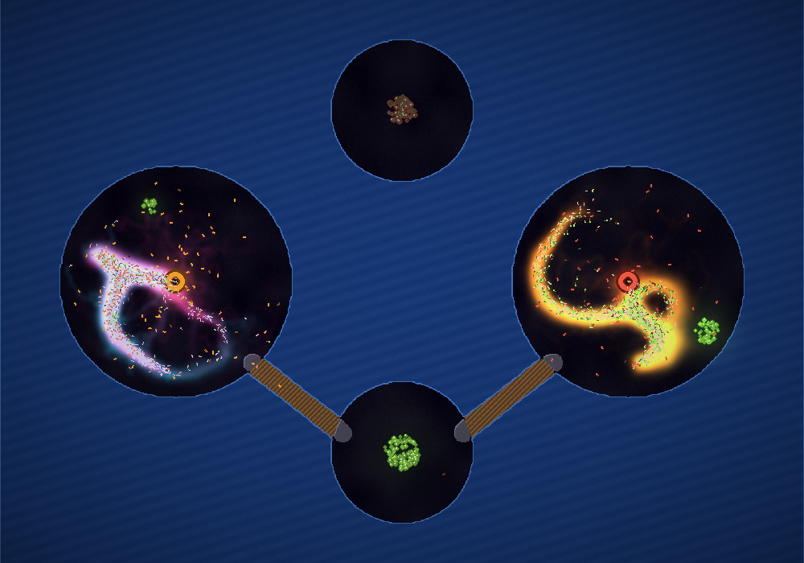

# ant_colony

An ant colony simulation in Python, built with Pygame and NumPy. Rival colonies of ants, none of them with a map or a plan, find food and build trails between it and their nest using nothing but chemical signals on the ground. Colonies that forage well grow, colonies that don't starve, and where their territories meet, they fight.


## What you're looking at

| Colour | Meaning |
|---|---|
| Amber, red and blue rings | Nests, one per colony (up to three). A nest's rim flashes red while the colony is going hungry. |
| Lime piles | **Sugar**: feeds the colony. Piles shrink as they're eaten and slowly dry up if nobody visits. |
| Salmon piles | **Protein**: makes raising new ants cheap. It turns brown and spoils if it's left untouched for two minutes. |
| Pink / orange / indigo glow | **Home pheromone**, laid by ants walking out from their nest (one colour per colony) |
| Cyan / yellow / mint glow | **Food pheromone**, laid by ants carrying food back (one colour per colony) |
| Pale ants | Workers and scouts |
| Ants in the nest's colour | Soldiers |
| Dim ants | Lost ants heading home to start over |
| Crumb at an ant's head | What it's carrying: lime for sugar, salmon for protein, gold for food stolen from a rival nest |
| Fading grey specks | Ants that have just died |
| Grey | Walls |
| Brown, blue, slate, planks | Sand, water, road and bridges |
| Black and red, eight legs | A spider |

## How it works

No ant knows where anything is. Each one follows a few local rules, and the trail network emerges from all of them together. This is called **stigmergy**: communication through changes to the environment.

**1. Every ant lays the trail the *other* ants need.**
A searching ant has just come from the nest, so the trail behind it leads home, and it lays home pheromone. An ant carrying food has just come from the food, so it lays food pheromone. Searchers follow food pheromone, and carriers follow home pheromone. Each colony has its own pair of pheromones and ignores everyone else's trails, except to avoid them.

**2. Trails point somewhere.**
Each ant's deposits get weaker the longer it has been since it left its nest or its food. So pheromone is strongest near the source and fades with distance: a gradient. Ants turn toward the stronger signal, so they climb the gradient to the source.

**3. Ants smell ahead.**
Each ant has three sensors in front of it: left, centre and right. Each sensor reads a small 3 × 3 patch of ground, and the ant turns toward the strongest. The bigger the difference between left and right, the harder it turns. A little random wander keeps it exploring.

**4. The ground forgets.**
Pheromone evaporates exponentially and spreads slightly into neighbouring cells, which keeps trails wide and steady. Trails that keep being used stay bright, and abandoned ones fade away. Rain washes trails away several times faster.

**5. Ants know when they're lost.**
If an ant's trail strength runs out before it finds anything, it gives up and heads home, following home pheromone and a rough sense of where the nest is. It can still pick up food if it walks into some on the way.

### In the first few seconds

Ants spill out of the nest in every direction, painting the area with home pheromone. Nobody has found food yet.


### Routing around walls

Paint a wall between a nest and its food, and the colony finds a way around. Ants that hit a wall slide off to a random side, and sensors that land inside a wall read as "worse than nothing", so ants steer away from them.


### The colony economy

Each colony keeps a store of sugar and protein.

- **Eating:** every ant eats from the store a little each second, wherever it is. Real ants share food mouth to mouth (trophallaxis), so the colony is fed as a whole. Sugar is eaten first, then protein. Faster ants eat more.
- **Going hungry:** when the store can't cover everyone, ants weaken in proportion to the shortfall. A colony that's slightly short shrinks slowly; one with nothing left starves within about 20 seconds.
- **Breeding:** once the store holds more than four minutes' worth of upkeep, the nest raises new ants. Each one costs food plus a little protein. Without protein, ants can still be raised on sugar alone, but at four times the cost.
- **Old age:** every ant dies of old age eventually (around five minutes), so a colony has to keep foraging just to stay the same size.

New food appears every 25 seconds within foraging range of a colony. Sugar that nobody visits for five minutes dries up, and protein spoils after two.

### Castes

| Caste | Job |
|---|---|
| **Workers** | Forage. |
| **Scouts** | Forage too, but wander more widely, take much longer to give up and lay weaker trails. Good at finding far-off food. |
| **Soldiers** | Don't forage. They hunt along rival colonies' home trails, raid rival nests to steal from their stores, and fight hard. They cost 2.5 times as much to raise. |

A colony decides what to hatch from its situation. When it's losing ants to fights, spiders or raids, it raises more soldiers (up to 40%). When it's struggling to find food, it raises more scouts.

### Competition

All colonies forage from the same food sources. Foragers shy away from rival colonies' home pheromone, so each colony tends to keep to its own territory. Where rival ants meet anyway, they fight. Each ant's chance of dying depends on how much enemy strength is right next to it, and soldiers hit four times as hard and take three times as much killing. Busy borders become battle lines, marked by dead ants.

### Evolution

Press `E` to turn it on. Every ant carries its own copy of six genes: speed, wander, how hard it turns toward food and home trails, and its sensor angle and distance. New ants inherit their colony's genes with small random mutations. Whenever ants bring food home, the colony's genes shift toward theirs, so traits that help foraging spread over time. Speed costs food, so the colony can't simply evolve faster and faster ants. Press `G` to watch each colony's genes alongside its population.



### Day, night, rain and spiders

A day lasts three minutes. At night the ground darkens and ants slow to about 60% speed. Rain comes and goes on its own, or with `R`, and washes trails away. Spiders wander in from the edge of the map now and then and hunt ants. Ants bite back, and soldiers can kill a spider.



### Terrain

Sand slows ants to half speed and roads speed them up. Water blocks them entirely, unless someone lays a road across it, which makes a bridge. The islands preset starts with colonies on separate islands and one bridge, and it's up to you to build the rest.



## Running it

You need Python 3 with [pygame-ce](https://pyga.me/) and NumPy. [Pillow](https://pypi.org/project/pillow/) is optional, for recording GIFs.

```bash
pip install pygame-ce numpy pillow
python main.py
```

### Command-line options

| Option | What it does |
|---|---|
| `--preset NAME` | Start from a scenario: `open` (default), `maze`, `corridor` (one colony, long winding path), `duel` (two colonies, one feeding ground) or `islands` |
| `--map PATH` | Start from a saved map |
| `--seed N` | Fix the random seed so a run can be repeated exactly |
| `--evolution` | Start with evolution on |
| `--headless` | Run without a window and print colony stats instead |
| `--seconds S` | Headless: how many simulated seconds to run (default 300) |
| `--report S` | Headless: seconds between printed reports (default 10) |
| `--csv PATH` | Headless: also write every report to a CSV file |

Headless runs are useful for comparing settings. The same seed always gives the same result, and a run goes about 6 to 8 times faster than real time:

```bash
python main.py --headless --seed 1 --seconds 900 --evolution --csv run.csv
```

### Controls

| Input | Action |
|---|---|
| `1`–`8` | Tools: wall, sugar, protein, sand, water, road, boot (squash ants), spider |
| Left mouse | Use the tool: drag to paint, click to place |
| Right mouse drag | Erase walls, terrain, food and spiders |
| `[` / `]` | Brush size, or the amount of food to place |
| Mouse wheel | Zoom in and out around the cursor |
| `W` `A` `S` `D`, middle drag, or arrow keys while the settings panel is closed | Pan |
| `0` | Show the whole map |
| `Space` | Pause or resume |
| `-` / `+` | Simulation speed, from ×0.25 to ×8 |
| `N` | Found a new colony at the cursor (up to three) |
| `E` | Evolution on or off |
| `R` | Start or stop rain |
| `P` | Show or hide the pheromone trails |
| `G` | Population and food graphs (plus genes when evolution is on) |
| `Tab` | Settings panel |
| `M` | Switch to the next preset |
| `Ctrl+S` / `Ctrl+O` | Save or load the map (`maps/saved.json`) |
| `I` | Save a screenshot to `captures/` |
| `V` | Start or stop recording a GIF to `captures/` (up to 30 seconds; without Pillow, a folder of PNG frames) |
| `H` | Hide or show the help |
| `Esc` | Quit |

Fast speeds run several small simulation steps per frame, so they cost frame rate. A few thousand ants run at 60 fps. With 10,000, the window drops to about 30 fps, and ×4 or ×8 run slower than the speed shown.

## Tuning

Press `Tab` to open the settings panel. You can drag the sliders, or use the up and down arrows to pick one and left and right to change it, all while the simulation runs. The panel covers the six genes, trails (deposit rate, evaporation, spread and how strongly ants avoid rivals), the economy (appetite, breeding costs, lifespan and how long ants survive starving), the world (how often food, spiders and rain arrive, and day length), fighting, and how big evolution's mutations are. With evolution on, the gene sliders only set the starting genes for new colonies.

Everything else is a constant in [`config.py`](config.py), including colony and population limits, caste strengths and costs, terrain speeds, spider stats and every colour. Each colony's colours come from the `PALETTES` list.

## Under the hood

| File | What's in it |
|---|---|
| [`sim.py`](sim.py) | The whole simulation. It doesn't import Pygame, so it can run headless. |
| [`render.py`](render.py) | The camera and everything drawn in the world |
| [`ui.py`](ui.py) | Panels, the HUD, graphs, screenshots and recording |
| [`maps.py`](maps.py) | Saving and loading maps, and the presets |
| [`config.py`](config.py) | Constants, colours and the live settings |
| [`main.py`](main.py) | The window loop, input and the command line |

- **Ants are arrays, not objects.** Every property (position, heading, colony, caste, cargo, age, genes, ...) is one NumPy array across all ants, and each simulation step updates every ant at once. A step with 10,000 ants takes about 15 ms. Births append to the arrays, and deaths drop elements with a boolean mask.
- **Pheromone fields** are `float32` arrays of shape (colonies × 400 × 300), one cell per 4 × 4 pixels of a 1600 × 1200 world. Sensing, depositing, evaporating and spreading each happen in a handful of whole-array operations. Python never loops over cells or ants.
- **Fighting** sorts ants into 8-pixel patches and uses `numpy.add.at` to total each colony's attack strength per patch, so every ant learns how much enemy strength surrounds it without comparing pairs of ants.
- **Frame-rate independence:** quantities that accumulate (movement, deposits, turning) scale with `* dt`. Quantities that decay multiplicatively (evaporation, deposit strength) scale with `** dt`. Fast speeds run several capped steps per frame, so ants can't skip through walls.
- **Rendering:** ants are written straight into the screen's pixel array, with no draw call per ant. Walls and terrain are drawn into one map-sized layer with smooth outlines and lighting. When you paint, only the changed rectangle is rebuilt. Trails are coloured on the grid and smoothly scaled up for the visible part of the map only.
- **Repeatable runs:** all of the simulation's randomness comes from one seeded generator, so `--seed` reproduces a run exactly.

## About this project

This was built step by step as a learning project. It started with the main loop and a single wandering ant, then added many ants, a pheromone grid, evaporation, sensing and steering, a food-and-nest state machine, deposit strength decay, rendering with surfarray, and walls. Later it gained a colony economy, competing colonies, castes, fighting, evolution, terrain, weather, predators, a camera, a NumPy rewrite of the ants, and tools for running and recording experiments.
