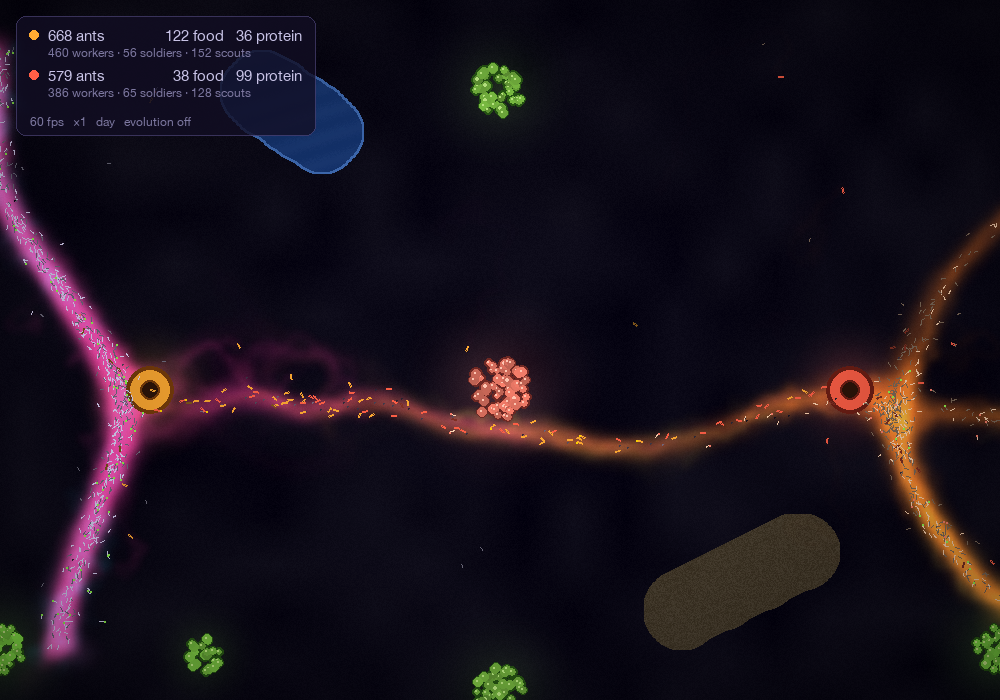
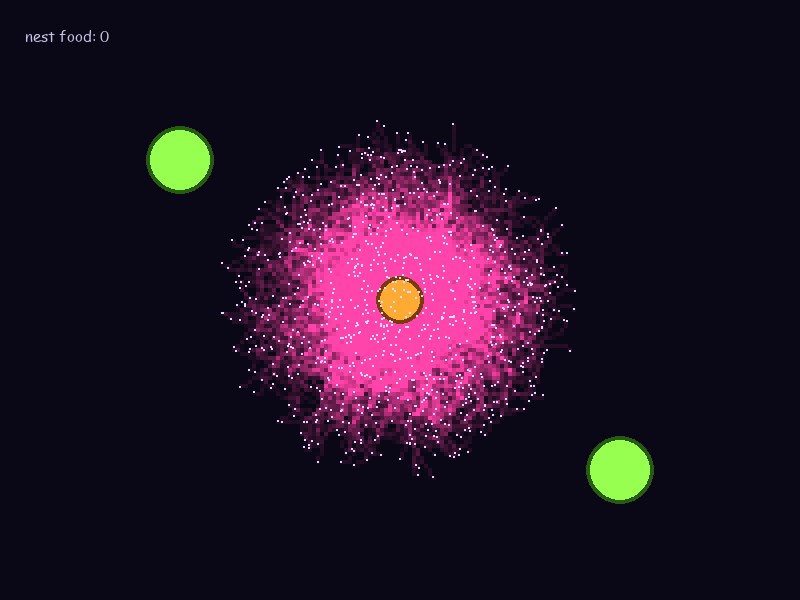
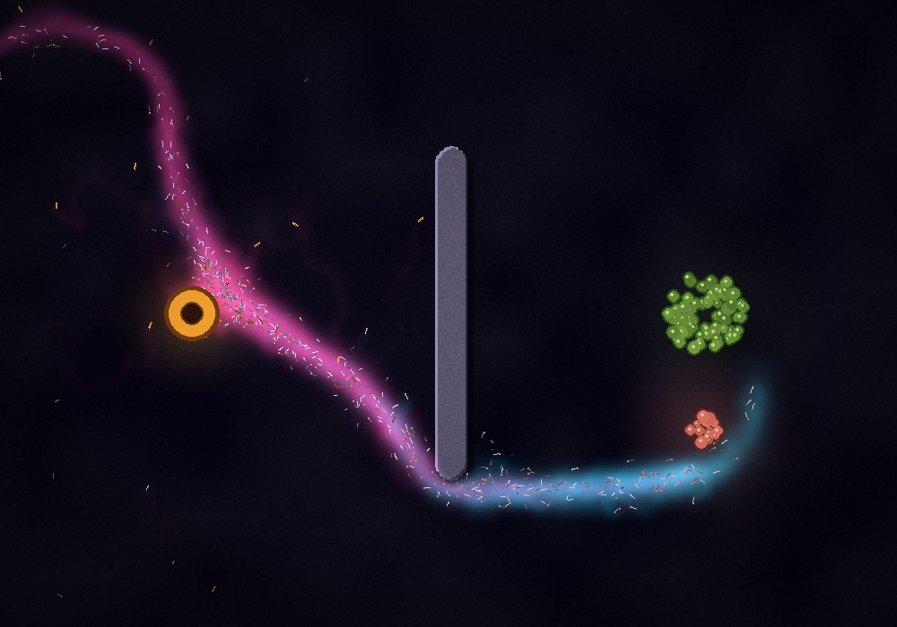

# ant_colony

An ant foraging simulation in Python, built with Pygame and NumPy. A thousand ants, none of them with a map or a plan, find food and build trails between it and their nest using nothing but two chemical signals on the ground.



## What you're looking at

| Colour | Meaning |
|---|---|
| Amber circle | The nest |
| Lime circles | Food sources (each holds 1000 units and vanishes when empty) |
| Pink glow | **Home pheromone**, laid by ants walking out from the nest |
| Cyan glow | **Food pheromone**, laid by ants carrying food back |
| White-hot | Both at once: a busy two-way highway |
| Pale dots | Ants searching for food |
| Lime dots | Ants carrying food home |
| Orange dots | Lost ants heading back to the nest to start over |
| Grey | Walls |

## How it works

No ant knows where anything is. Each one follows a few local rules, and the trail network emerges from all of them together. This is called **stigmergy**: communication through changes to the environment.

**1. Every ant lays the trail the *other* ants need.**
A searching ant has just come from the nest, so the trail behind it leads home, and it lays home pheromone. An ant carrying food has just come from the food, so it lays food pheromone. Searchers follow food pheromone, and carriers follow home pheromone.

**2. Trails point somewhere.**
Each ant's deposits get weaker the longer it has been since it left its nest or its food. So pheromone is strongest near the source and fades with distance: a gradient. Ants always turn toward the stronger signal, so they climb the gradient to the source. This one rule took the colony from 11 to 70 deliveries per minute while the project was being built.

**3. Ants smell ahead.**
Each ant has three sensors in front of it: left, centre and right. Each frame it compares the three readings and turns toward the strongest, with a little random wander added so it keeps exploring.

**4. The ground forgets.**
Every cell of pheromone evaporates exponentially. Trails that keep being used stay bright, and abandoned ones, like the route to a food source that has run out, fade away.

**5. Ants know when they're lost.**
If a searching ant's trail strength falls below a threshold before it finds anything, it gives up, turns around and follows home pheromone back to the nest to start again. It can still pick up food if it walks into some on the way.

### In the first few seconds

Ants spill out of the nest in every direction, painting the area pink with home pheromone. Nobody has found food yet.



### Routing around walls

Paint a wall between the nest and the food, and the colony finds routes around both ends of it. Ants that hit a wall slide off to a random side, and sensors that land inside a wall read as "worse than nothing", so ants steer away from them.



## Running it

You need Python 3 with [pygame-ce](https://pyga.me/) and NumPy.

```bash
pip install pygame-ce numpy
python main.py
```

### Controls

| Input | Action |
|---|---|
| Left mouse drag | Paint wall |
| Right mouse drag | Erase wall |
| `F` | Drop a new food source at the cursor |
| `C` | Clear all walls |
| `Esc` | Quit |

The counter in the top-left shows the frame rate and how much food the colony has delivered.

## Tuning

All the behaviour is controlled by constants at the top of [`main.py`](main.py). Some good ones to experiment with:

| Constant | What it does |
|---|---|
| `NUM_ANTS` | Colony size |
| `EVAPORATION_RETENTION` | Fraction of pheromone left on the ground after one second. Lower values make trails fade faster. |
| `PHEREMONE_RETENTION` | How slowly an ant's deposit strength decays. Higher values make longer, flatter gradients. |
| `TURN_RATE` / `WANDER_WEIGHT` | How strongly ants follow trails versus explore. Too much turn and they spin in circles (an "ant mill", which real ants do too). |
| `SENSOR_DISANCE` / `SENSOR_ANGLE` | How far ahead and how wide the ants look |
| `SIZE_CELLS` | Pixels per pheromone cell |

All colours are named constants too, so you can make your own palette.

## Under the hood

- **Pheromone fields** are two 200 × 150 `float32` NumPy arrays (one cell per 4 × 4 pixels). Evaporation is a single in-place multiply over the whole array each frame. Python never loops over cells.
- **Frame-rate independence:** quantities that accumulate (movement, deposits, turning) scale with `* dt`. Quantities that decay multiplicatively (evaporation, deposit strength) scale with `** dt`. The simulation behaves the same at 30 FPS as at 60.
- **Rendering** builds an RGB image with NumPy broadcasting (each pheromone tints its own colour, and they add where they overlap), sends it to Pygame in one `surfarray.blit_array` call, and scales it up to the window. Walls are drawn with one boolean-mask assignment.
- **Walls** are a third grid with `dtype=bool`, reusing the same position-to-cell lookup as the pheromone grids.

## About this project

This was built step by step as a learning project, in ten stages: the main loop, a wandering ant, many ants, a pheromone grid, evaporation, sensing and steering, a food-and-nest state machine, deposit strength decay, rendering with surfarray, and walls.
